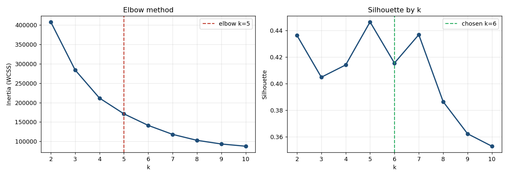
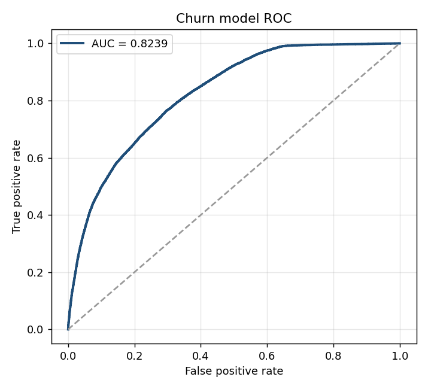

<h1 align="center">Telecom Subscriber Segmentation &amp; Churn</h1>

<p align="center">
  Six behavioural segments recovered from an unlabelled subscriber base with K-Means and a
  Gaussian Mixture Model, a supervised churn classifier layered on top, a randomised
  control-group design, and an interactive console for choosing the classification threshold.
</p>

<p align="center">
  
  
  <a href="LICENSE"></a>
  <a href="METHODOLOGY.md"></a>
</p>

<p align="center">
  <strong><a href="https://21pravi.github.io/Customer_Segmentation_Model/">▶ Open the live dashboard</a></strong>
</p>

---

> [!IMPORTANT]
> **This project runs on a synthetic dataset.** `src/data.py` generates a subscriber base from
> six latent behavioural populations, with realistic data-quality defects injected on purpose.
> The feature schema, business rules and modelling pipeline are production-equivalent, and
> **every metric in this repository is computed from an actual run** — nothing is hand-written.
> What is simulated is the *input*, not the *results*.
>
> Absolute figures (₹5.20 Cr monthly revenue, 28.79% churn) describe the simulated base and are
> not observed commercial results. To point the same code at a real extract, set
> `USE_SYNTHETIC = False` in `src/config.py` and fill in `COLUMN_MAP`.

---

## Why this repository might interest you

Most segmentation projects report an accuracy score for a clustering model. Clustering is
unsupervised — there is no ground truth for an assignment to be right or wrong about, so
accuracy, precision and recall do not exist for it. This project is built in two stages
precisely because of that distinction:

| Stage | Model | Evaluated with |
|---|---|---|
| Segmentation *(unsupervised)* | Gaussian Mixture, 6 components | Silhouette, Davies–Bouldin, Calinski–Harabasz, BIC |
| Churn *(supervised)* | Random Forest | Accuracy, precision, recall, F1, ROC-AUC, PR-AUC, MCC |

Three further decisions are documented rather than assumed:

- **Segment names attach to revenue rank, not cluster id.** Mixture-model cluster ids permute
  across seeds and library versions; a fixed id→name mapping silently relabels the entire base
  the first time anything changes.
- **The control group is randomised, then verified.** A 3% holdout is drawn at random within
  each segment, and balance is confirmed with standardised mean differences across every
  covariate (largest |SMD| = 0.0216). A holdout selected on any outcome-correlated quantity is
  not a control group.
- **Accuracy is not the headline metric.** At a 28.79% base rate, predicting that nobody churns
  scores 71.21% accuracy. The dashboard reproduces this — set the threshold to 0.99.

Reasoning, assumptions and **limitations** are documented in **[METHODOLOGY.md](METHODOLOGY.md)**.

---

## Quickstart

```bash
git clone https://github.com/21pravi/Customer_Segmentation_Model.git
cd Customer_Segmentation_Model
pip install -r requirements.txt

make all
```

<details>
<summary>Without <code>make</code></summary>

```bash
python stage_a_segment.py       # load → clean → cluster → profile → name    (~50s)
python stage_b_predict.py       # churn model → surrogate → campaign         (~160s)
python predict_samples.py       # score 10 unseen subscribers
python build_dashboard_data.py  # emit dashboard_data.json + dashboard.html
```

The pipeline is split in two because a single run exceeds a typical CPU budget on one core.
`stage_a` writes a checkpoint that `stage_b` resumes from.

</details>

Then open **`outputs/dashboard.html`** — not `dashboard_template.html`, which is a build input
and still contains the data placeholder.

---

## Pipeline

| Stage | Module | Step |
|---|---|---|
| 1 | `data.py` | Load, optimise dtypes (`float32` / `int8`) |
| 2 | `preprocess.py` | Dedupe → AON filter → invalid values → impute → cap outliers → engineer → scale |
| 3 | `cluster.py` | k-sweep: inertia, silhouette, Davies–Bouldin, Calinski–Harabasz |
| 4 | `cluster.py` | K-Means and GMM fitted and compared |
| 5 | `cluster.py` | Profile clusters, name by revenue rank |
| 6 | `classify.py` | Churn classifier — 3 candidates, selected on ROC-AUC, threshold tuned |
| 7 | `classify.py` | Segment surrogate — fast forest reproducing the GMM boundary |
| 8 | `campaign.py` | Stratified random 3% control group, balance-checked; offers assigned |
| 9 | — | Persist models, export CSVs, write `metrics.json` |

Step order within stage 2 is load-bearing: dedupe before imputation (duplicates skew medians),
AON filter before imputation (impute from the modelled population), impute before capping (IQR
fences need complete columns), engineer after capping (no ratios on uncapped extremes), scale
last.

---

## Results

All figures read from `outputs/metrics.json`, produced by a real run.

**Data.** 201,000 raw → 195,640 modelled. 1,000 duplicates removed, 4,360 dropped by the
90-day age-on-network filter, 1,105 negative revenues floored, 6,807 values imputed. Base churn
rate **28.79%**.

**Choosing k.** Kneedle elbow and silhouette maximum both indicate k=5 (silhouette 0.4465).
**k=6 ships** — a business constraint, since the campaign supports six offers. The cost is
quantified rather than concealed: silhouette falls to 0.4156.

**Clustering.**

| | K-Means | GMM |
|---|---|---|
| Silhouette ↑ | **0.4156** | 0.3922 |
| Davies–Bouldin ↓ | **0.9139** | 0.9304 |
| Calinski–Harabasz ↑ | **9,385** | 8,595 |
| BIC ↓ | n/a | −629,263 |
| Soft assignment | no | **yes** |

They agree on 90.42% of subscribers. GMM deploys because it returns an assignment probability:
5,594 subscribers fall below 0.60 confidence and can be routed to review rather than receive a
high-cost offer on a coin-flip assignment.

**Segments**, ranked by mean revenue.

| Rank | Segment | Subscribers | Avg revenue | Avg data | DOU | Churn |
|---|---|---|---|---|---|---|
| 1 | Premium Power | 13,628 | ₹803 | 24.0 GB | 27.9 | 1.0% |
| 2 | Loyal Core | 53,309 | ₹377 | 14.3 GB | 25.6 | 7.8% |
| 3 | Sleeping Giant | 11,258 | ₹367 | 15.2 GB | 25.1 | 18.5% |
| 4 | Deal Seeker | 45,617 | ₹205 | 8.2 GB | 21.3 | 31.3% |
| 5 | Question Mark | 18,947 | ₹112 | 3.4 GB | 10.4 | 49.9% |
| 6 | Comfortably Numb | 52,881 | ₹102 | 2.9 GB | 10.3 | 49.6% |

**Churn model.** Random Forest, selected on ROC-AUC from three candidates. Held-out test set of
39,128 subscribers (11,266 churners). At the F1-optimal threshold **0.4978**:

| Accuracy | Precision | Recall | Specificity | F1 | ROC-AUC | PR-AUC | MCC |
|---|---|---|---|---|---|---|---|
| 0.7209 | 0.5102 | 0.7651 | 0.7030 | 0.6122 | **0.8239** | 0.6458 | 0.4279 |

Confusion matrix: TN 19,587 · FP 8,275 · FN 2,646 · TP 8,620.
Five-fold CV ROC-AUC **0.8179 ± 0.0045** — the narrow spread indicates stable behaviour rather
than a favourable split.

Histogram gradient boosting scores the *highest* accuracy of the three candidates (0.7850) and
the *lowest* F1 (0.5449). That is why accuracy was not the selection criterion.

Top churn drivers: `aon` (0.243), `average_revenue` (0.230), `average_dou` (0.176),
`average_data_usage` (0.073).

**Campaign.** 189,771 treatment / 5,869 control (97 / 3). All six covariates balanced, largest
|SMD| = 0.0216. Monthly revenue ₹5.20 Cr; revenue at risk ₹1.37 Cr.

<p align="center">
  
  <br>
  
</p>

---

## Layout

```
├── src/
│   ├── config.py          every tunable, incl. the real-CSV switch
│   ├── data.py            synthetic generator + real loader
│   ├── preprocess.py      cleaning, AON filter, fences, feature engineering
│   ├── cluster.py         k-sweep, K-Means, GMM, profiling, rank-naming
│   ├── classify.py        churn model + segment surrogate + metric suite
│   ├── campaign.py        stratified control group, balance check, offer book
│   └── predict.py         SegmentScorer — score unseen subscribers
├── stage_a_segment.py     stages 1–5, writes a checkpoint
├── stage_b_predict.py     stages 6–9, resumes from it
├── predict_samples.py     10 unseen subscribers incl. 3 edge cases
├── build_dashboard_data.py
├── outputs/dashboard.html ← open this
├── METHODOLOGY.md         assumptions, decisions, limitations
└── figures/
```

`data/`, `models/` and the two full per-subscriber exports are gitignored: they are
regenerable and total ~140 MB. Aggregate CSVs, `metrics.json` and the rendered dashboard are
committed as evidence of a real run.

---

## Scoring a new subscriber

```python
from src.predict import predict_customer

predict_customer(avg_data=19.5, avg_rev=300.0, avg_dou=26, pack_flag=0, aon=1500)
```

Training-time outlier fences and the 90-day AON rule are enforced at inference, not only at
training. A 30-day SIM returns `UNSEGMENTED (AON < 90d)`; a 950 GB corporate SIM is capped to
the 40.74 GB training fence; negative revenue is floored to zero. All ten worked examples are
in `outputs/sample_predictions.csv`.

---

## Scaling to production volume

Executed here on 200,000 subscribers, single CPU core. At ~57 million rows:

- `silhouette_score` is **O(n²)** in time and memory — already subsampled to 10,000
  (`SIL_SAMPLE`); scores are stable above that (0.4153 → 0.4107 across 5k → 20k).
- `MiniBatchKMeans` for the k-sweep; GMM with `warm_start=True` over chunks.
- `HistGradientBoostingClassifier`, not `GradientBoostingClassifier` — it bins features once
  instead of sorting at every split. Measured **15× faster** here (1.8s vs 28.7s); the exact
  implementation does not complete at production scale.
- `float32` / `int8`. Four `float64` columns at 57M rows occupy ~1.8 GB before any compute.
- Parquet over CSV for intermediate checkpoints.

---

## License

MIT — see [LICENSE](LICENSE).
